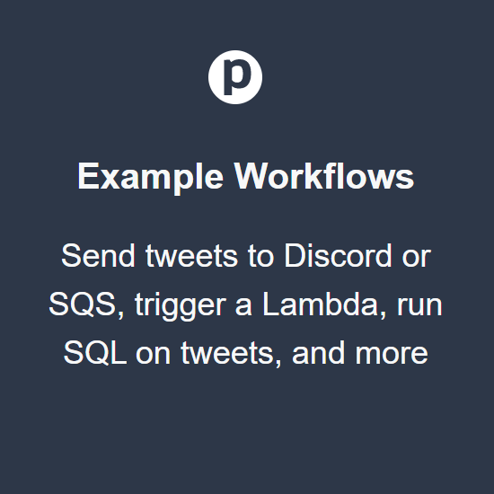
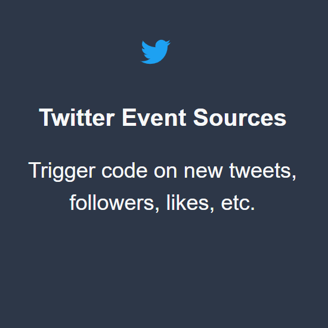
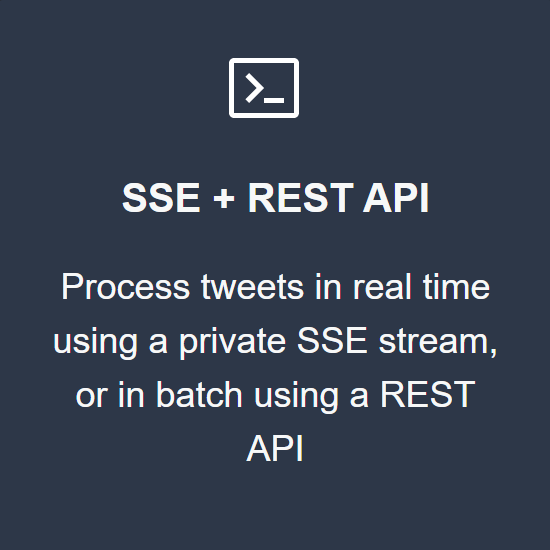
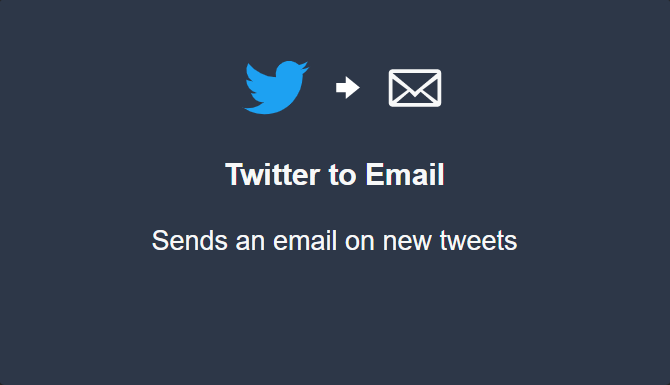
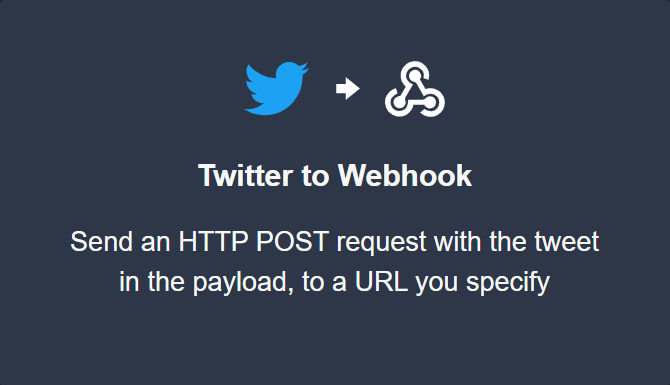

<p align="center">
        </p>
<h1 align="center"><strong>Twitter Workflow Automation</strong></h1>

<p align="center">Patterns for processing streams of tweets and interacting with the Twitter API</p>

<p align="center">
    <a alt="Getting Started" href="#example-workflows"></a>
    <a alt="Example Worksflows" href="#twitter-event-sources"></a>
    <a "SSE + REST API" href="#sse-and-rest-apis"></a>
</p>

&nbsp;&nbsp;

## Example Workflows
Workflows are linear sequences of steps — just Node.js code —hosted and run by Pipedream.

**You can copy the workflows below and run them in your Pipedream account** [**for free**](https://docs.pipedream.com/pricing/ ). They run code on new tweets and interact with the Twitter API in creative ways. You can modify or extend them in any way you'd like, [**running your own Node code**](https://docs.pipedream.com/workflows/steps/code/) or using [**pre-built functions**](https://docs.pipedream.com/workflows/steps/actions/) to connect to [**200+ integrated apps**](https://docs.pipedream.com/apps/all-apps/).

On copy, you'll be asked to create a [**Twitter event source**](#getting-started) that triggers your workflow on new tweets matching your target search.

A single Twitter source can trigger multiple workflows. If you already created a source you want to use as a trigger, click **Select Another Trigger** near the bottom-left of the source selector.

<p align="center">
    
    
</p>

&nbsp;&nbsp;

## Twitter Event Sources

Pipedream [**event sources**](https://docs.pipedream.com/event-sources/) emit Twitter events in real time: tweets, follows, likes, and more. Sources can trigger [**Pipedream workflows**](#example-workflows), and can be accessed via [**SSE or REST APIs**](#apis).

Click on a source below to get started.


Let's see how sources work with an end-to-end example:**running code on new mentions**.

Most Twitter bots react to other tweets. For example, you might want to reply to a user with a specific message every time they mention you. Or you may want to store every tweet with a specific hashtag in an Amazon S3 bucket.

When you create a Twitter bot, you typically have to sign up for a Twitter developer account, create your own app, host it somewhere, and run code to poll for new tweets. This is a means to an end:**all you really want to do is run code on new tweets**.

```js
// Don't care how I get tweets
for (const tweet of tweets) {
    // Just want to run code
}
```

Pipedream lets you create a stream of tweets you can process programmatically in seconds, avoiding the app setup entirely. These are called [**event sources**](https://docs.pipedream.com/event-sources/).

Pipedream runs the code to poll for new tweets matching your search terms, emitting them as events you can run code on.

<p align="center">
    <kbd></kbd>
</p>

Then, you can immediately process those tweets in a few different ways:

+ Trigger a Pipedream workflow for each tweet, running hosted Node.js code in real time
+ Subscribe to a private SSE stream, which also publishes tweets in real time
+ Access tweets in batch using Pipedream's REST API

To get started, [**create a new Twitter search source in the Pipedream UI**](https://pipedream.com/sources?action=create&amp;url=https%3A%2F%2Fgithub.com%2FPipedreamHQ%2Fpipedream%2Fblob%2Fmaster%2Fcomponents%2Ftwitter%2Fsearch-twitter.js&amp;app=twitter&amp;src=twitter.pipedream.com). Name the source, connect your Twitter account, and add your search term:

<p align="center">
    <kbd></kbd>
</p>

You can also visit [**https://pipedream.com/sources**](https://pipedream.com/sources) and click the **Create Source** button, then choose the **twitter/twitter-search.js** source from the modal that appears.

Then, you can trigger a [**Pipedream workflow**](https://pipedream.com/new) — a serverless Node.js script — on every tweet:

<p align="center">
    <kbd></kbd>
</p>

or process items in your own app using [**the SSE stream or REST API**](#apis) tied to your source.

&nbsp;&nbsp;

## SSE and REST APIs

Pipedream provides two other interfaces for accessing events produced by sources:

+ A private SSE stream specific to your source
+ A REST API

This way, you can run an event source in Pipedream but access its events in your own application.

### SSE

SSE —[**Server-sent events**](https://developer.mozilla.org/en-US/docs/Web/API/Server-sent_events)—defines a spec for how servers can send events directly to clients that subscribe to those events, similar to [**WebSockets**](https://developer.mozilla.org/en-US/docs/Web/API/WebSockets_API) and related server-to-client push technologies. If you listen for new items using SSE, **you can run any code in your own application, in real time, as soon as those items are added to the feed.**

Streams are private by default. You authenticate by passing your Pipedream API key in the Authorization header:

```js
$ curl -H "Authorization: Bearer API_KEY" \

https://api.pipedream.com/sources/SOURCE_ID/sse
```

[**See the Pipedream SSE docs**](https://docs.pipedream.com/api/sse) for more information on authentication, example Node code, and other details on the interface.

### REST API

If you prefer to process tweets in batch, you can fetch them using [**Pipedream's REST API**](https://docs.pipedream.com/api/rest/):

```js
$ curl -H "Authorization: Bearer API_KEY" \

https://api.pipedream.com/v1/sources/SOURCE_ID/event_summaries?limit=1
```

Note the?limit=1query string. You can vary the number of events returned (most recent first) by setting this param.

Please [**reach out**](https://docs.pipedream.com/support/) with any questions or feedback. We're happy to add other Twitter-specific developer resources to this list, and we'd love to hear what can be improved about event sources or the example workflows.
    
&nbsp;&nbsp;

___

<p align="center">
Pipedream, Inc. — San Francisco, CA
</p>
<p align="center">
<a href="https://twitter.com/PipedreamHQ">Twitter</a> | <a href="https://pipedream.com/community">Community</a> | <a href="https://docs.pipedream.com/">Docs</a> | <a href="https://pipedream.com/terms">Terms</a> |
    <a href="https://pipedream.com/privacy">Privacy</a>
</p>

___
